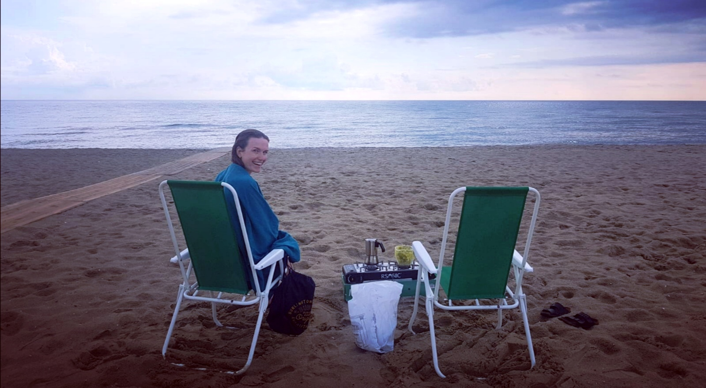

Hello and welcome to this infohub for my students, but obviously *anyone* is welcome... :)

Here, after some time, I will hopefully have a collection of approaches that might help you to get into certain topics and be the most efficient and at the same time help me to actually structure and digest my learnings. Nothing is perfect, so whenever you find some mistakes, please let me know! :)

# See you around! 

